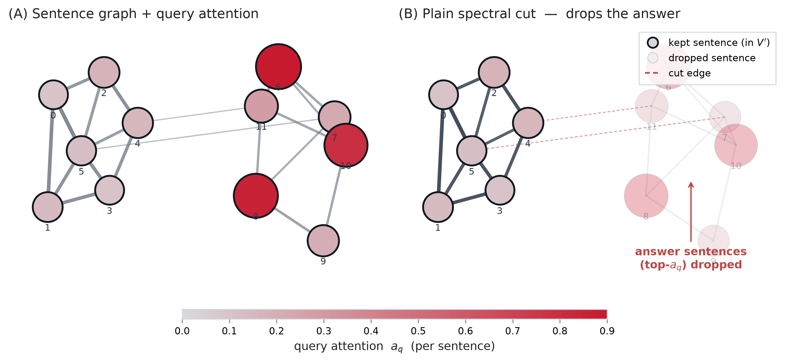

<div class="center">

*Spectral cut of the attention graph produces good results for text compression tasks without any training.*

</div>

# Attention graphs rationale

For most of the deep-learning era, text has been modeled as a **sequence** under the autoregressive factorization: read tokens left to right, predict the next one, repeat. The Transformer relaxed *how* context is mixed — attention is all-to-all — but kept the sequential decoding assumption intact: the output still emerges one token at a time, strictly in order.

That assumption is starting to crack from two directions.

**Non-autoregressive text generators are becoming competitive.** Continuous and discrete diffusion language models — Diffusion-LM (Li et al., 2022), SEDD (Lou, Meng & Ermon, 2024), and the recent large-scale LLaDA (Nie et al., 2025) and Inception Labs’ *Mercury* (2025) — denoise a whole block of text in parallel rather than emit it left-to-right. When tokens are produced jointly, the relevant question shifts from “what comes next” to **what depends on what**: which spans constrain which other spans, which sentences carry the load for a particular answer, which substructure can be edited without breaking the rest.

**A growing body of work argues that Transformers are already a kind of graph neural network in disguise** (Joshi, 2020; Kim et al., 2022) — attention is a learned, dynamic weighted graph over tokens (Abnar & Zuidema, 2020), and downstream applications increasingly *use* LLMs as explicit graph reasoners (Graph of Thoughts, Besta et al., 2023; Talk Like a Graph, Fatemi et al., 2024). The shared move in both threads is to treat the relational structure between text units as a first-class object, not a byproduct of left-to-right decoding.

Put together, the picture is consistent: as generation and reasoning become more structural, the **graph view of text** — sentences and tokens as nodes, attention as edges — stops being a metaphor and becomes a concrete representation we can compute on. And once you have a real weighted graph, decades of graph theory become available: connectivity, community detection, spectral clustering, **graph cuts**.

This article reports a small, concrete experiment in that direction. We take an existing, very practical LLM tool — a context compressor — and ask: *if we redraw what it does as a graph problem, can classical graph algorithms reproduce it, or even beat it, with no training at all?* The answer turns out to be “mostly yes,” and the way it fails is as informative as the way it succeeds.

# At a glance

**What we did.** We re-cast Sentinel’s attention-based context compression as a graph-cut problem on the sentence-level attention graph. For each `(context, question)` pair in LongBench-En we extract the proxy model’s sentence-level attention graph $`W`$ and a per-sentence query-attention vector $`a_q`$, define a query-anchored normalized cut $`\mathrm{NCut}_q`$, and ask whether Sentinel’s kept set $`V'`$ minimizes it. When the answer is no in an instructive way — the structurally optimal cut throws away the answer — we build a training-free spectral solver, `anchored_spectral_cut`, that pins the top query-attention sentences and fills the rest with a Fiedler sweep plus local search. Every cut runs on a 0.5B proxy graph; downstream QA F1 is scored by a 4-bit Qwen2.5-7B reader. 174 LongBench-En examples across six QA tasks, three compression rates, no training.

**Headline findings.**

- Sentinel is *not* the $`\mathrm{NCut}_q`$-optimal cut — a plain spectral cut beats it on the graph objective on 100 % of records, at every rate.

- But that “optimal” cut is *worse* at actually answering questions: it drops the high-attention, answer-bearing sentences (top-attention coverage falls to $`0.31`$ at $`5\times`$).

- The anchored cut fixes this with no training: top-attention coverage becomes $`1.00`$ by construction, it still beats Sentinel on $`\mathrm{NCut}_q`$ 100 % of the time, and it matches or beats Sentinel’s reader F1 when `anchor_frac` is chosen per rate.

- At $`2\times`$ compression the training-free anchored cut is the best compressor outright; at $`5\times`$ it recovers $`90\,\%`$ of the spec$`\rightarrow`$Sentinel F1 gap.

The most characteristic single result is the pooled reader F1 across the anchor-fraction sweep — Table <a href="#tab:headline" data-reference-type="ref" data-reference="tab:headline">1</a>. The rest of this article walks through how we got there.

| **rate** | **uncomp.** | **spec** | **@0.1** | **@0.25** | **@0.5** | **top_attn** | **Sentinel** |
|:---|---:|---:|---:|---:|---:|---:|---:|
| $`2\times`$ | 0.155 | 0.246 | 0.258 | **0.272** | 0.250 | 0.265 | 0.248 |
| $`3\times`$ | 0.155 | 0.167 | 0.204 | 0.229 | **0.233** | 0.246 | 0.254 |
| $`5\times`$ | 0.155 | 0.145 | 0.158 | 0.188 | **0.218** | 0.207 | 0.226 |

**Headline result.** Pooled reader F1 (mean across six LongBench-En tasks) for every method at every compression rate. The anchored cut wins outright at $`2\times`$ and recovers most of the spec$`\rightarrow`$Sentinel gap at $`3\times`$ and $`5\times`$, all without training. Bold marks the best anchored value per rate. {#tab:headline}

<figure id="fig:graph-cut" data-latex-placement="h">

<figcaption><strong>Why the structurally optimal cut fails at QA.</strong> A synthetic 12-sentence graph where edge weight reflects attention flow and node color/size reflect the query-attention score <span class="math inline"><em>a</em><sub><em>q</em></sub></span> (panel A; deep red = answer-bearing sentences). At <span class="math inline">50 %</span> budget, the plain spectral cut picks the structurally cohesive left community as <span class="math inline"><em>V</em><sup>′</sup></span> (panel B; dark borders) and drops every high-attention sentence (faded nodes, dashed cut edges). This is the failure mode the anchored cut is designed to prevent.</figcaption>
</figure>

# The starting point: Sentinel

[**Sentinel**](https://arxiv.org/abs/2505.23277) (Zhang et al., 2025) is a context compressor with a clever, almost cheeky idea. Long prompts are expensive and “lost in the middle” hurts accuracy, so you’d like to throw away the irrelevant sentences before sending the context to a big model. Most compressors train a dedicated model to do this. Sentinel doesn’t.

Instead it grabs a small, off-the-shelf **0.5B proxy model**, feeds it `context + question`, and reads the **attention** of the final prompt token. Sentences the small model “pays attention to” when it is about to answer are the sentences worth keeping. Sort by attention, keep the top fraction under your budget, done. No fine-tuning, no labels, no compression-specific training. On LongBench it compresses up to $`5\times`$ while matching 7B-scale compression baselines.

It’s a strong result, and it raises an irresistible question. Sentinel’s whole signal *is* attention — and attention is a weighted graph over tokens. So:

> **What is Sentinel doing, in graph terms?**

If we build the sentence-level attention graph and look at the set of sentences Sentinel keeps, is that set *special* in some graph-theoretic sense? A community? A min-cut? A central cluster? If we could name the structure, we could (a) understand the method, and (b) maybe reproduce it with a principled algorithm instead of a heuristic sort.

# Turning attention into a graph

The plumbing is straightforward. For one `(context, question)` pair:

1.  Run the 0.5B proxy, collect attention from every layer and head: a tensor $`[L, H, N, N]`$ over $`N`$ tokens.

2.  Average over layers and heads $`\rightarrow`$ an $`[N, N]`$ token-level weight matrix $`W_{\text{tok}}`$.

3.  **Pool to sentences.** With a membership matrix $`M`$ (token $`\rightarrow`$ sentence), $`W = M^\top W_{\text{tok}} M`$ gives a $`[K, K]`$ **sentence graph**: nodes are sentences, edge weights record how much attention flows between two sentences. Symmetrize, zero the diagonal.

4.  **Query anchor.** Take the attention *from the final prompt token* (the one about to answer) to every token, pool it per sentence $`\rightarrow`$ a vector $`a_q`$ of length $`K`$. This is “how relevant is each sentence to the question,” and it is exactly the signal Sentinel sorts on.

So each example is a small weighted graph $`W`$ plus a per-node relevance score $`a_q`$. Sentinel’s kept set is just a subset $`V'`$ of the nodes. Time to ask what $`V'`$ is.

> A practical note: the full $`[L, H, N, N]`$ attention tensor is $`O(N^2)`$ per layer and OOMs a 12 GiB GPU at LongBench lengths. We wrote a streaming extractor that pools each layer’s attention to $`[K, K]`$ immediately and throws the big tensor away — peak memory dropped from $`\sim`$<!-- -->22 GB to $`\sim`$<!-- -->3.8 GB at 8k tokens. Boring engineering, but without it none of the rest happens.

## Two hypotheses

We made the question precise with two falsifiable claims.

**H1 — “compressed text $`\approx`$ induced subgraph.”** If you take Sentinel’s compressed text and rebuild the graph *from scratch* ($`\hat{G}`$), is it the same as just keeping Sentinel’s nodes in the original graph (the induced subgraph $`G[V']`$)? In other words, does compression preserve graph structure?

**H2 — “Sentinel $`\approx`$ optimal cut.”** Define a **query-anchored normalized cut**:
``` math
\begin{equation*}
{\mathrm{NCut}_q}(V') \;=\; \frac{\mathrm{cut}(V', V\setminus V')}{\mathrm{vol}(V')} \;-\; \alpha\cdot\frac{\mathrm{att}_q(V')}{\mathrm{vol}(V')}.
\end{equation*}
```
The first term is the classic normalized cut (keep a well-separated cluster); the second rewards keeping high-query-attention mass. Lower is better. Is Sentinel’s $`V'`$ close to the set that *minimizes* $`\mathrm{NCut}_q`$?

H2 is the interesting one. If true, Sentinel is secretly solving a graph-cut problem, and we could replace the heuristic with a real spectral solver.

# The experiments

**Data.** LongBench-En, 6 English QA tasks (`multifieldqa_en`, `hotpotqa`, `2wikimqa`, `qasper`, `narrativeqa`, `musique`), 30 examples each, 174 total, lengths 1.5k–10k tokens, fixed seed. A small SQuAD subset was used early on, where graphs are tiny enough to compute the *exact* optimal cut by brute force as a gold standard.

**Models.** The proxy/graph model is **Qwen2.5-0.5B-Instruct**. The downstream **reader** that actually answers questions is **Qwen2.5-7B-Instruct** (4-bit), scored with LongBench’s SQuAD-style token-F1. Nothing is trained — everything is off-the-shelf inference.

**Compression rates.** $`2\times`$, $`3\times`$, $`5\times`$ (keep 50 % / 33 % / 20 % of the context).

The cut solvers we put up against Sentinel, all at the same sentence budget:

| **solver** | **what it does** | **trained?** |
|:---|:---|:---|
| `spec` | Fiedler-vector spectral cut (classic NCut relaxation) | no |
| `top_attn` | top-$`K`$ sentences by query attention $`a_q`$ | no |
| `anchored` (ours) | spectral cut that guarantees the top-attention sentences are kept | no |
| `exact` | brute-force $`\mathrm{NCut}_q`$ minimum (small graphs only, gold standard) | no |
| Sentinel | the attention-sort baseline we are explaining | no$`^{*}`$ |

Cut solvers compared at the same sentence budget. <sup>\*</sup>Sentinel runs in raw-attention mode here; its trained classifier is unused. {#tab:solvers}

# What we found

## H1: structure is preserved, but loosely

The induced subgraph and the rebuilt graph are similar but not identical, and the similarity erodes with compression. The Davis–Kahan angle (how far the graphs’ eigenspaces rotate apart) grows steadily:

| **metric**           |    $`2\times`$ |    $`3\times`$ |    $`5\times`$ |
|:---------------------|---------------:|---------------:|---------------:|
| Davis–Kahan angle    | $`23.9^\circ`$ | $`36.7^\circ`$ | $`43.2^\circ`$ |
| edge-weight Spearman |           0.89 |           0.80 |           0.75 |
| top-5 edge recall    |           0.60 |           0.60 |           0.60 |

H1 metrics across compression rates.

“Compressed text is approximately the induced subgraph” holds at mild compression and weakens at aggressive compression. Reasonable, not earth-shaking.

## H2: Sentinel is not the optimal cut

Here is the twist. The spectral cut beats Sentinel on $`\mathrm{NCut}_q`$ 100 % of the time, at every rate. On the graph’s own objective, Sentinel is not optimal — not even close.

| **rate**    | **Sentinel** |  **spec** | **top_attn** |
|:------------|-------------:|----------:|-------------:|
| $`2\times`$ |        0.359 | **0.142** |        0.340 |
| $`3\times`$ |        0.471 | **0.207** |        0.446 |
| $`5\times`$ |        0.556 | **0.282** |        0.545 |

Median $`\mathrm{NCut}_q`$ (lower is better) across rates.

So H2 is **rejected**. If you literally minimize the query-anchored normalized cut, you get a much cleaner cut than Sentinel’s. Case closed, spectral wins, ship it?

Not so fast. We sent the spectral cut’s compressed text to the 7B reader. The QA F1 collapsed:

| **rate**    | **spec F1** | **Sentinel F1** |
|:------------|------------:|----------------:|
| $`2\times`$ |       0.246 |           0.248 |
| $`3\times`$ |   **0.167** |           0.254 |
| $`5\times`$ |   **0.145** |           0.226 |

Reader F1 of the spectral cut vs. Sentinel. 

At $`3\times`$ and $`5\times`$ the “optimal” cut is far worse at actually answering questions. We dug into the worst cases and the reason was immediate: **the spectral cut throws away the answer.** It optimizes graph structure so aggressively that it drops the high-attention, answer-bearing sentences in favor of structurally-cohesive but query-irrelevant ones. Measured directly — what fraction of the top query-attention sentences survives the cut?

| **rate**    | **spec coverage** | **anchored (foreshadowing)** |
|:------------|------------------:|-----------------------------:|
| $`2\times`$ |              0.35 |                     **1.00** |
| $`3\times`$ |              0.41 |                     **1.00** |
| $`5\times`$ |              0.31 |                     **1.00** |

Top-attention coverage: fraction of the top-$`m`$ query-attention sentences kept by each cut. {#tab:coverage}

The spectral cut keeps only about a third of the top-attention sentences. That is the whole failure in one number: the graph objective and the QA objective have quietly diverged.

> Side note: we also tried the “principled” fix — fold $`a_q`$ into the spectral sweep with a weight $`\alpha`$ (`query_anchored_spectral_cut`). At $`\alpha = 1`$ it turned out to be byte-identical to the plain spectral cut. The query term is on a totally different scale than the unit-norm Fiedler vector, so it does nothing. A reminder that “just add a regularizer” is not a plan.

## The fix: an anchored cut that cannot drop the answer

If the failure is “the cut drops answer-bearing sentences,” the fix writes itself: don’t let it. Our `anchored_spectral_cut`:

1.  **Pins** the top-$`m`$ sentences by query attention ($`m = \texttt{anchor\_frac}\times\text{budget}`$). These are guaranteed to be in the kept set.

2.  **Fills** the remaining budget with a spectral (Fiedler) sweep over the rest.

3.  **Refines** with a local search that swaps the non-pinned slots to minimize $`\mathrm{NCut}_q`$ — while the pinned sentences stay put.

It is the best of both worlds by construction: you keep the query-relevant content *and* you still get a structurally clean cut on everything else. No training — it is eigenvectors and a greedy swap.

How does it do on the graph objective? It still beats Sentinel on $`\mathrm{NCut}_q`$ 100 % of the time, for a tiny cost over the unconstrained spectral cut ($`+0.025`$ median). And coverage of the top-attention sentences goes to a perfect 1.00. So far it is free.

The real test is QA. We swept $`\texttt{anchor\_frac} \in \{0.1, 0.25, 0.5\}`$; the pooled reader F1 was given in Table <a href="#tab:headline" data-reference-type="ref" data-reference="tab:headline">1</a> at the top of the article. Read that table slowly — there is a lot in it.

**The spectral cut’s QA collapse is fixed.** Forcing the answer sentences back in recovers most of the lost F1. Table <a href="#tab:gap-recovery" data-reference-type="ref" data-reference="tab:gap-recovery">7</a> shows the fraction of the spec$`\rightarrow`$Sentinel gap that anchoring closes.

| **rate**    | **@0.1** | **@0.25** | **@0.5** |
|:------------|---------:|----------:|---------:|
| $`3\times`$ |     43 % |      71 % |     76 % |
| $`5\times`$ |     16 % |      53 % | **90 %** |

Fraction of the spec$`\rightarrow`$Sentinel F1 gap recovered by the anchored cut. {#tab:gap-recovery}

At $`5\times`$, the anchored cut at $`\texttt{anchor\_frac} = 0.5`$ recovers **90 %** of the gap to Sentinel and beats `top_attn` (0.218 vs. 0.207) — while keeping $`\mathrm{NCut}_q`$ far below Sentinel’s. The single change “guarantee the answer sentences” did that.

**At $`2\times`$ compression, the training-free graph cut is the best compressor, period.** `anchored@0.25` (0.272) beats Sentinel (0.248), `top_attn` (0.265), and the raw spectral cut (0.246). A classic spectral algorithm with an attention prior, no learning, wins outright.

**The best `anchor_frac` depends on the compression rate.** Light compression wants light pinning ($`\approx 0.25`$); aggressive compression wants heavy pinning ($`\approx 0.5`$). Intuition: at $`2\times`$ you have budget to spare, so over-pinning wastes it on structure-blind choices; at $`5\times`$ the budget is tiny and guaranteeing the answer is almost everything.

## Per-dataset: where it wins, and where attention itself runs out

Breaking F1 down by task (best `anchor_frac` per row in bold) shows the rate-dependent optimum is not a pooled artifact — it holds dataset by dataset.

| **task**        |  **@0.1** | **@0.25** |  **@0.5** |
|:----------------|----------:|----------:|----------:|
| 2wikimqa        |     0.230 | **0.273** |     0.233 |
| hotpotqa        |     0.439 | **0.483** |     0.420 |
| multifieldqa_en | **0.368** |     0.342 |     0.300 |
| musique         |     0.225 |     0.247 | **0.254** |
| narrativeqa     |     0.110 | **0.126** |     0.122 |
| qasper          | **0.171** |     0.158 |     0.170 |

Per-task reader F1 at $`2\times`$ (rate $`0.5`$). 

| **task**        |  **@0.1** | **@0.25** |  **@0.5** |
|:----------------|----------:|----------:|----------:|
| 2wikimqa        |     0.222 | **0.292** |     0.231 |
| hotpotqa        |     0.326 |     0.366 | **0.392** |
| multifieldqa_en |     0.266 |     0.256 | **0.293** |
| musique         |     0.111 |     0.186 | **0.202** |
| narrativeqa     |     0.101 |     0.095 | **0.110** |
| qasper          | **0.182** |     0.173 |     0.167 |

Per-task reader F1 at $`3\times`$ (rate $`0.67`$). 

| **task**        | **@0.1** | **@0.25** |  **@0.5** |
|:----------------|---------:|----------:|----------:|
| 2wikimqa        |    0.115 |     0.176 | **0.235** |
| hotpotqa        |    0.267 |     0.256 | **0.364** |
| multifieldqa_en |    0.260 |     0.258 | **0.299** |
| musique         |    0.057 | **0.182** |     0.125 |
| narrativeqa     |    0.097 |     0.095 | **0.098** |
| qasper          |    0.133 |     0.158 | **0.170** |

Per-task reader F1 at $`5\times`$ (rate $`0.8`$). 

The structured multi-document QA tasks — `2wikimqa`, `hotpotqa`, `multifieldqa_en` — are where the anchored cut shines, frequently beating Sentinel (e.g. `hotpotqa@0.25` at $`2\times`$ is 0.483 vs. Sentinel 0.423; `multifieldqa@0.5` at $`5\times`$ is 0.299 vs. 0.257). The hold-outs are `musique` (multi-hop) and `narrativeqa` (narrative), where Sentinel keeps a small lead and no `anchor_frac` closes it.

That last point is the honest, useful caveat: on those tasks the *answer is not where the attention is*. Multi-hop and narrative questions need sentences that are not query-salient on their own, so an attention-anchored method — Sentinel included — has a ceiling there. The graph cut is not worse than attention; it is bounded by the same signal.

# So what does it mean?

A few things, in increasing order of ambition.

**1. We can name what Sentinel does.** It is approximately “top-$`K`$ by query attention,” and it is emphatically *not* the optimal query-anchored graph cut. The trained classifier buys almost nothing over the raw attention sort. That is a clean interpretability result.

**2. A training-free graph algorithm matches or beats it.** The `anchored_spectral_cut` — Fiedler vectors, an attention prior, and a greedy swap, zero learned parameters — equals or beats Sentinel on most tasks and at $`2\times`$ is the best compressor outright. The pieces are all classical; the novelty is gluing a spectral cut to a query-attention anchor and letting graph structure pick the rest.

**3. The graph objective and the task objective can diverge — and the graph view lets you see it.** The most aggressive $`\mathrm{NCut}_q`$ minimizer was the worst at QA, and we could diagnose exactly why (top-attention coverage 0.31) and fix it surgically. That diagnose-and-repair loop is a graph-theory affordance. You do not get it from a sorted list of scores.

And the bigger bet, the reason this is more than a compression tweak: as text generation moves from sequential to holistic — diffusion models writing a whole passage at once, planners laying out structure before surface form — the natural unit of computation stops being “the next token” and becomes “the relationships among all the pieces.” That is a graph. Here we showed, on a real long-context QA benchmark, that off-the-shelf attention already contains a usable graph, and that classical graph cuts operate on it competitively with no training whatsoever. If a 30-year-old spectral method with an attention prior can hang with a purpose-built LLM compressor, the graph-structured view of text is worth taking seriously — not as a replacement for attention, but as the lens that makes attention’s structure legible and actionable.

Text is not only a line. Increasingly, it is a graph. And graphs we know how to cut.

# Reproduce it

Everything is in the repository (see `PROJECT_GUIDE.md` for the full map). The short version:

    # build the graphs + H1/H2 panel
    python experiments/longbench/run_eval_h1h2.py

    # add the anchored cut and sweep anchor_frac
    python experiments/longbench/rerun_h2_anchored.py
    python experiments/longbench/sweep_anchor_frac.py

    # reader QA + the tradeoff tables
    python experiments/longbench/run_qa.py \
        --eval-path results_h1h2_anchored/longbench_h1h2_latest.jsonl \
        --out-dir results_qa_anchored --baselines anchored
    python experiments/longbench/summarize_anchor_frac_qa.py

The cut solvers live in `spectral/cut_solvers.py`; the graph construction in `spectral/streaming_extractor.py` and `spectral/graph_builder.py`; the hypotheses in `spectral/h1_test.py` and `spectral/h2_test.py`.

*All numbers above are medians (NCut) or means (F1) over 174 LongBench-En examples, Qwen2.5-0.5B proxy + Qwen2.5-7B reader, no training of any component.*

# References

<div class="description">

Abnar, S. & Zuidema, W. (2020). *Quantifying Attention Flow in Transformers*. The attention-rollout technique used to aggregate multi-layer attention.

Besta, M., Blach, N., Kubicek, A. et al. (2023). *Graph of Thoughts: Solving Elaborate Problems with Large Language Models*.

Fatemi, B., Halcrow, J. & Perozzi, B. (2024). *Talk Like a Graph: Encoding Graphs for Large Language Models*.

Joshi, C. K. (2020). *Transformers are Graph Neural Networks*. The Gradient.

Kim, J., Nguyen, T., Min, S. et al. (2022). *Pure Transformers are Powerful Graph Learners*.

Li, X. L., Thickstun, J., Gulrajani, I., Liang, P. & Hashimoto, T. (2022). *Diffusion-LM Improves Controllable Text Generation*.

Lou, A., Meng, C. & Ermon, S. (2024). *Discrete Diffusion Modeling by Estimating the Ratios of the Data Distribution* (SEDD).

Nie, S. et al. (2025). *LLaDA: Large Language Diffusion Models*.

Inception Labs (2025). *Mercury* — a diffusion-based large language model.

Zhang, Y. et al. (2025). *Sentinel: Attention Probing of Proxy Models for LLM Context Compression*. arXiv:2505.23277.

</div>
